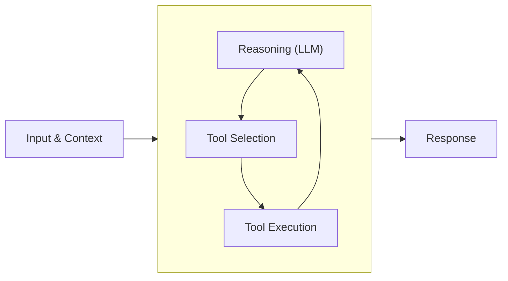
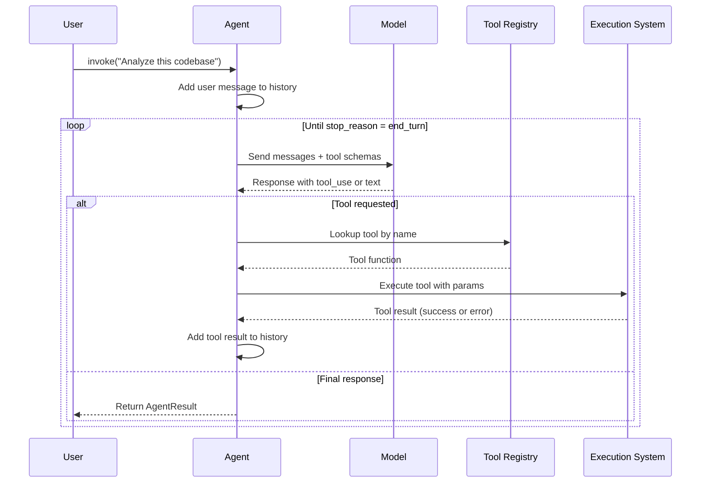
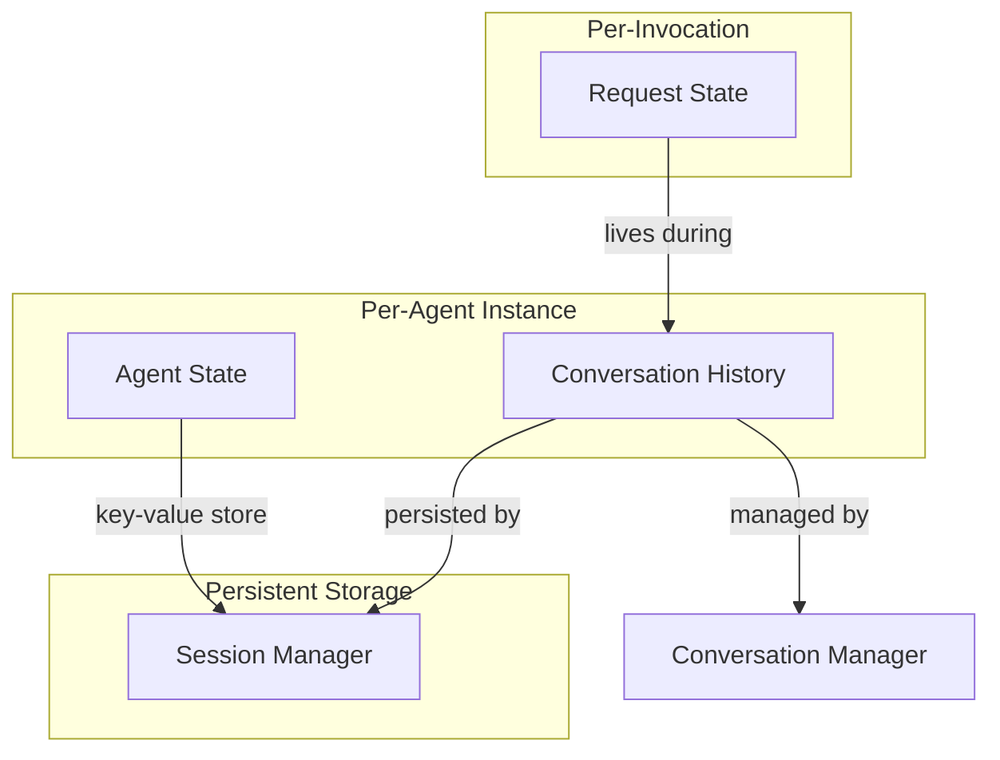
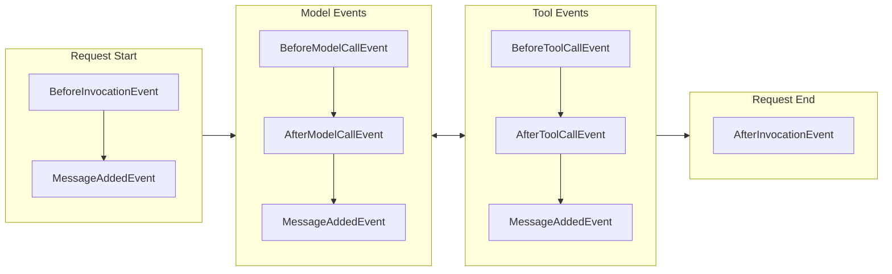
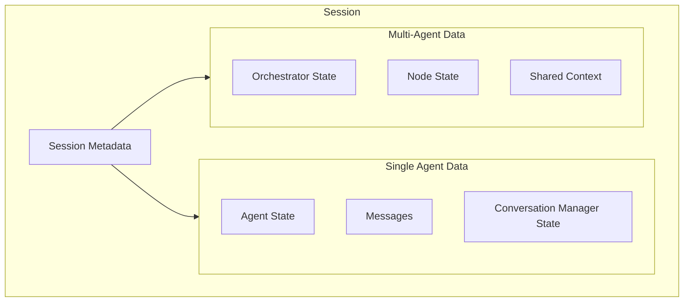
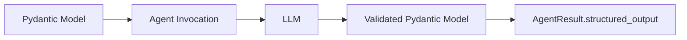

---
tags:
  - ai
  - agents
  - llm
  - production
  - strands
---

# Strands Agents: Complete Systems Architecture

A deep architectural reference for building production AI agents with the Strands Agents SDK. This document focuses on understanding how the system works at a fundamental level—the mental models, data flows, and design decisions that shape everything we build.

---

## Part 1: Philosophy and Design Intent

### What Problem Does This Solve?

Language models can answer questions. Agents can **do things**. The difference is significant.

When a model receives a request it cannot fully address with its training alone, it needs to reach out into the world: read files, query databases, call APIs, execute code. The Strands Agents SDK provides the orchestration layer that enables this. It manages the cycle of reasoning and action that allows a model to tackle problems requiring multiple steps, external information, or real-world side effects.

### The Core Mental Model

An agent is not just "an LLM with tools." It's a **control loop with memory**. Every agent invocation follows this pattern:



The model reasons, selects a tool (or not), the tool executes, and the result feeds back into the model for another round of reasoning. This cycle continues until the model decides it has enough information to respond.

What makes this powerful is the **accumulation of context**. Each iteration through the loop adds to the conversation history. The model sees not just the original request, but every tool it has called and every result it has received. This accumulated context enables sophisticated multi-step reasoning.

### Design Decisions That Shape Everything

1. **Loop-centric architecture**: Everything builds on the agent loop primitive
2. **Context as working memory**: Conversation history is the model's scratchpad
3. **Tools as capabilities**: What an agent can do is defined by its tools
4. **State separation**: Conversation history vs. agent state vs. request state
5. **Composability**: Hooks, managers, and providers can be mixed and matched

---

## Part 2: System Architecture and Data Flow

### The Agent Loop in Detail

When we invoke an agent, here's what actually happens:



### Message Flow and Roles

Messages flow through the agent loop with two roles: **user** and **assistant**.

**User messages** contain:

- Text input from the user
- Tool results from previous tool executions
- Media such as files, images, audio, or video

**Assistant messages** contain:

- Text responses for the user
- Tool use requests for the execution system
- Reasoning traces (when supported by the model)

The conversation history accumulates all message types across loop iterations. This history is the model's **working memory** for the task.

### Stop Reasons: How the Loop Ends

Each model invocation ends with a stop reason that determines what happens next:

| Stop Reason | Meaning | What Happens |
|-------------|---------|--------------|
| `end_turn` | Model finished responding | Loop exits, returns final message |
| `tool_use` | Model wants to use tools | Execute tools, continue loop |
| `max_tokens` | Response truncated | **Unrecoverable** - loop terminates with error |
| `stop_sequence` | Configured stop sequence hit | Loop exits normally |
| `content_filtered` | Safety mechanism blocked response | Loop terminates |
| `guardrail_intervention` | Guardrail policy stopped generation | Loop terminates |

### Tool Execution System

When the model requests a tool:

```python
# What happens internally
1. Validate request against tool's schema
2. Locate tool in the registry by name
3. Execute with error handling
4. Format result as tool result message
5. Add to conversation history
6. Continue loop
```

The execution system captures both successful results and failures. When a tool fails, the error information goes back to the model as an error result rather than throwing an exception that terminates the loop. This gives the model an opportunity to **recover or try alternatives**.

---

## Part 3: State Management Architecture

Strands maintains state in three distinct forms, each with different lifecycles and purposes:

### The Three Types of State



### Conversation History

The primary form of context. Directly accessible through the agent:

```python
from strands import Agent

agent = Agent()
agent("Hello!")

# Access the conversation history
print(agent.messages)  # Shows all messages exchanged
```

Key characteristics:

- Maintained between calls to the agent
- Passed to the model during each inference
- Used for tool execution context
- Managed to prevent context window overflow

We can initialize an agent with existing messages to continue a conversation:

```python
agent = Agent(messages=[
    {"role": "user", "content": [{"text": "Hello, my name is Jay!"}]},
    {"role": "assistant", "content": [{"text": "Hi Jay! How can I help?"}]}
])

# Continue the conversation
agent("What's my name?")  # Model knows it's "Jay"
```

### Agent State

Key-value storage for stateful information **outside** of the conversation context. Unlike conversation history, agent state is **not** passed to the model during inference but can be accessed and modified by tools and application logic.

```python
from strands import Agent

# Create an agent with initial state
agent = Agent(state={
    "user_preferences": {"theme": "dark"},
    "session_count": 0
})

# Access state values
theme = agent.state.get("user_preferences")

# Set new state values
agent.state.set("last_action", "login")
agent.state.set("session_count", 1)

# Delete state values
agent.state.delete("last_action")
```

Agent state enforces **JSON serialization validation**—we can't store functions or non-serializable objects:

```python
# This will raise ValueError
agent.state.set("function", lambda x: x)  # Not JSON serializable
```

### Request State

Contextual information maintained within a **single request**. Useful for:

- Passing database connections to tools
- Request-specific configuration
- Custom logger instances
- Any per-invocation context

```python
def custom_callback_handler(**kwargs):
    if "request_state" in kwargs:
        state = kwargs["request_state"]
        if "counter" not in state:
            state["counter"] = 0
        state["counter"] += 1

agent = Agent(callback_handler=custom_callback_handler)
result = agent("Hi there!")
print(result.state)  # Access request state from result
```

---

## Part 4: Conversation Management

As conversations grow, managing context becomes critical:

- **Token Limits**: Language models have fixed context windows
- **Performance**: Larger contexts require more processing time
- **Relevance**: Older messages may become less relevant
- **Coherence**: We must preserve important information

### Built-in Conversation Managers

#### NullConversationManager

Does not modify conversation history. Useful for:

- Short conversations that won't exceed context limits
- Debugging purposes
- Cases where we want to manage context manually

```python
from strands import Agent
from strands.agent.conversation_manager import NullConversationManager

agent = Agent(conversation_manager=NullConversationManager())
```

#### SlidingWindowConversationManager (Default)

Maintains a fixed number of recent messages:

```python
from strands.agent.conversation_manager import SlidingWindowConversationManager

conversation_manager = SlidingWindowConversationManager(
    window_size=20,              # Maximum messages to keep
    should_truncate_results=True, # Truncate large tool results
    per_turn=True                # Apply management every model call
)

agent = Agent(conversation_manager=conversation_manager)
```

Key features:

- **Maintains Window Size**: Removes oldest messages when limit exceeded
- **Dangling Message Cleanup**: Removes incomplete message sequences
- **Overflow Trimming**: Trims when context window overflow occurs
- **Configurable Tool Result Truncation**: Large results can be truncated

The `per_turn` parameter controls when management happens:

- `False` (default): Only after agent loop completes
- `True`: Before every model call
- Integer `N`: Every N model calls

#### SummarizingConversationManager

Intelligently summarizes older messages instead of discarding them:

```python
from strands.agent.conversation_manager import SummarizingConversationManager

conversation_manager = SummarizingConversationManager(
    summary_ratio=0.3,              # Summarize 30% of messages
    preserve_recent_messages=10,    # Always keep 10 most recent
    summarization_system_prompt="""
    Summarize this technical conversation focusing on:
    - Code changes and architectural decisions
    - Specific function names and file paths
    - Actionable information only
    """
)
```

We can even use a different (cheaper) model for summarization:

```python
from strands.models import AnthropicModel

summarization_model = AnthropicModel(
    model_id="claude-3-5-haiku-20241022",  # More cost-effective
    max_tokens=1000,
    params={"temperature": 0.1}  # Low temperature for consistency
)

custom_summarization_agent = Agent(model=summarization_model)

conversation_manager = SummarizingConversationManager(
    summarization_agent=custom_summarization_agent
)
```

---

## Part 5: The Hooks System

Hooks are the extensibility mechanism for observing, modifying, and extending agent behavior. The system is composable and type-safe.

### Hook Event Lifecycle



### Creating a Hook Provider

```python
from strands.hooks import HookProvider, HookRegistry
from strands.hooks import BeforeInvocationEvent, AfterInvocationEvent

class LoggingHook(HookProvider):
    def register_hooks(self, registry: HookRegistry) -> None:
        registry.add_callback(BeforeInvocationEvent, self.log_start)
        registry.add_callback(AfterInvocationEvent, self.log_end)

    def log_start(self, event: BeforeInvocationEvent) -> None:
        print(f"Request started for agent: {event.agent.name}")

    def log_end(self, event: AfterInvocationEvent) -> None:
        print(f"Request completed for agent: {event.agent.name}")

# Use the hook
agent = Agent(hooks=[LoggingHook()])
```

### Available Hook Events

| Event | When It Fires | Use Cases |
|-------|--------------|-----------|
| `AgentInitializedEvent` | After agent construction | Setup, validation |
| `BeforeInvocationEvent` | Start of new request | Logging, auth |
| `AfterInvocationEvent` | End of request | Cleanup, metrics |
| `MessageAddedEvent` | Message added to history | Auditing |
| `BeforeModelCallEvent` | Before LLM inference | Context injection |
| `AfterModelCallEvent` | After LLM inference | Response validation, retry |
| `BeforeToolCallEvent` | Before tool execution | Interception, modification |
| `AfterToolCallEvent` | After tool execution | Result modification |

### Practical Hook Patterns

#### Limiting Tool Calls

```python
from strands.hooks import HookProvider, HookRegistry
from strands.hooks import BeforeToolCallEvent, BeforeInvocationEvent
from threading import Lock

class LimitToolCounts(HookProvider):
    def __init__(self, max_tool_counts: dict[str, int]):
        self.max_tool_counts = max_tool_counts
        self.tool_counts = {}
        self._lock = Lock()

    def register_hooks(self, registry: HookRegistry) -> None:
        registry.add_callback(BeforeInvocationEvent, self.reset_counts)
        registry.add_callback(BeforeToolCallEvent, self.intercept_tool)

    def reset_counts(self, event: BeforeInvocationEvent) -> None:
        with self._lock:
            self.tool_counts = {}

    def intercept_tool(self, event: BeforeToolCallEvent) -> None:
        tool_name = event.tool_use["name"]
        with self._lock:
            max_count = self.max_tool_counts.get(tool_name)
            count = self.tool_counts.get(tool_name, 0) + 1
            self.tool_counts[tool_name] = count

            if max_count and count > max_count:
                event.cancel_tool = (
                    f"Tool '{tool_name}' has been invoked too many times. "
                    f"DO NOT CALL THIS TOOL ANYMORE."
                )

# Usage
agent = Agent(
    tools=[my_tool],
    hooks=[LimitToolCounts(max_tool_counts={"expensive_api": 3})]
)
```

#### Model Call Retry with Backoff

```python
import asyncio
from strands.hooks import HookProvider, HookRegistry
from strands.hooks import BeforeInvocationEvent, AfterModelCallEvent

class RetryOnServiceUnavailable(HookProvider):
    def __init__(self, max_retries: int = 3):
        self.max_retries = max_retries
        self.retry_count = 0

    def register_hooks(self, registry: HookRegistry) -> None:
        registry.add_callback(BeforeInvocationEvent, self.reset_counts)
        registry.add_callback(AfterModelCallEvent, self.handle_retry)

    def reset_counts(self, event: BeforeInvocationEvent = None) -> None:
        self.retry_count = 0

    async def handle_retry(self, event: AfterModelCallEvent) -> None:
        if event.exception:
            if "ServiceUnavailable" in str(event.exception):
                if self.retry_count < self.max_retries:
                    self.retry_count += 1
                    event.retry = True
                    await asyncio.sleep(2 ** self.retry_count)  # Exponential backoff
        else:
            self.reset_counts()
```

---

## Part 6: Session Management

Session management enables persisting agent state and conversation history across multiple interactions or application restarts.

### What Gets Persisted



### Basic Usage

```python
from strands import Agent
from strands.session.file_session_manager import FileSessionManager

# Create a session manager with a unique session ID
session_manager = FileSessionManager(
    session_id="user-123",
    storage_dir="/path/to/sessions"  # Optional
)

# Create an agent with the session manager
agent = Agent(session_manager=session_manager)

# Use the agent - all messages and state are automatically persisted
agent("Hello!")  # This conversation is persisted
```

### S3 Session Manager

For cloud-based persistence in distributed environments:

```python
from strands.session.s3_session_manager import S3SessionManager
import boto3

boto_session = boto3.Session(region_name="us-west-2")

session_manager = S3SessionManager(
    session_id="user-456",
    bucket="my-agent-sessions",
    prefix="production/",
    boto_session=boto_session
)

agent = Agent(session_manager=session_manager)
```

### Storage Structure

Both file and S3 session managers use this structure:

```
/<sessions_dir>/
└── session_<session_id>/
    ├── session.json                # Session metadata
    ├── agents/                     # Single agent storage
    │   └── agent_<agent_id>/
    │       ├── agent.json          # Agent metadata and state
    │       └── messages/
    │           ├── message_<id>.json
    │           └── message_<id>.json
    └── multi_agents/               # Multi-agent storage
        └── multi_agent_<orchestrator_id>/
            └── multi_agent.json    # Orchestrator state
```

### Session Persistence Triggers

Session persistence happens automatically at key lifecycle events:

**Single Agent Events:**

- Agent Initialization → Restores existing state
- Message Addition → Persists new message
- Agent Invocation → Syncs agent state after completion

**Multi-Agent Events:**

- Orchestrator Initialization → Restores orchestrator state
- Node Execution → Syncs state after node transitions
- Orchestration Complete → Captures final state

---

## Part 7: Prompts and System Configuration

### System Prompts

System prompts set the foundation for how the model behaves:

```python
from strands import Agent

agent = Agent(
    system_prompt=(
        "You are a financial advisor specialized in retirement planning. "
        "Use tools to gather information and provide personalized advice. "
        "Always explain your reasoning and cite sources when possible."
    )
)
```

If we don't specify a system prompt, the model uses its default behavior.

### Multi-Modal Prompting

The SDK supports images, documents, and other content types:

```python
with open("path/to/image.png", "rb") as fp:
    image_bytes = fp.read()

response = agent([
    {"text": "What can you see in this image?"},
    {
        "image": {
            "format": "png",
            "source": {"bytes": image_bytes},
        },
    },
])
```

### Direct Tool Calls

For programmatic control, we can bypass natural language and call tools directly:

```python
# Direct call - added to conversation history by default
result = agent.tool.current_time(timezone="US/Pacific")

# Direct call without recording
result = agent.tool.current_time(
    timezone="US/Pacific",
    record_direct_tool_call=False
)
```

---

## Part 8: Structured Output

Structured output transforms unstructured LLM outputs into reliable, type-safe Python objects.



### Basic Usage

```python
from pydantic import BaseModel, Field
from strands import Agent

class PersonInfo(BaseModel):
    """Model that contains information about a Person"""
    name: str = Field(description="Name of the person")
    age: int = Field(description="Age of the person")
    occupation: str = Field(description="Occupation of the person")

agent = Agent()
result = agent(
    "John Smith is a 30 year-old software engineer",
    structured_output_model=PersonInfo
)

person_info: PersonInfo = result.structured_output
print(f"Name: {person_info.name}")        # "John Smith"
print(f"Age: {person_info.age}")          # 30
print(f"Job: {person_info.occupation}")   # "software engineer"
```

### Combining with Tools

```python
from strands import Agent
from strands_tools import calculator
from pydantic import BaseModel, Field

class MathResult(BaseModel):
    operation: str = Field(description="the performed operation")
    result: int = Field(description="the result of the operation")

agent = Agent(tools=[calculator])
res = agent("What is 42 + 8", structured_output_model=MathResult)
```

### Agent-Level Defaults

We can set a default structured output model for all invocations:

```python
# All invocations will use PersonInfo
agent = Agent(structured_output_model=PersonInfo)
result = agent("John Smith is a 30 year-old software engineer")

# Override for specific calls
result = agent(
    "TechCorp is a software company with 500 employees",
    structured_output_model=CompanyInfo  # Uses CompanyInfo instead
)
```

### Error Handling

```python
from strands.types.exceptions import StructuredOutputException

try:
    result = agent(prompt, structured_output_model=MyModel)
except StructuredOutputException as e:
    print(f"Structured output failed: {e}")
```

---

## Part 9: Deployment to Amazon Bedrock AgentCore

Amazon Bedrock AgentCore Runtime is a secure, serverless runtime purpose-built for deploying and scaling dynamic AI agents.

### Key Capabilities

- **Session Isolation**: Dedicated microVMs for each user session
- **Session Persistence**: Highly reliable with automatic persistence
- **Auto-Scaling**: Scales to thousands of agent sessions in seconds
- **Identity Integration**: Works with Cognito, Entra ID, Okta, Google, GitHub
- **Pay-per-use**: Only pay for actual usage

### SDK Integration Approach

```python
from bedrock_agentcore.runtime import BedrockAgentCoreApp
from strands import Agent

app = BedrockAgentCoreApp()
agent = Agent()

@app.entrypoint
def invoke(payload):
    """Process user input and return a response"""
    user_message = payload.get("prompt", "Hello")
    result = agent(user_message)
    return {"result": result.message}

if __name__ == "__main__":
    app.run()
```

### Streaming Support

```python
from strands import Agent
from bedrock_agentcore import BedrockAgentCoreApp

app = BedrockAgentCoreApp()
agent = Agent()

@app.entrypoint
async def agent_invocation(payload):
    """Handler for agent invocation with streaming"""
    user_message = payload.get("prompt", "No prompt found")
    stream = agent.stream_async(user_message)
    async for event in stream:
        yield event

if __name__ == "__main__":
    app.run()
```

### Deployment with Starter Toolkit

```bash
# Install
pip install bedrock-agentcore-starter-toolkit

# Configure
agentcore configure --entrypoint agent_example.py

# Optional: Local testing (requires Docker)
agentcore launch --local

# Deploy to AWS
agentcore launch

# Test
agentcore invoke '{"prompt": "Hello"}'
```

### Manual Deployment with boto3

```python
import boto3

client = boto3.client('bedrock-agentcore-control', region_name="us-east-1")

response = client.create_agent_runtime(
    agentRuntimeName='hello-strands',
    agentRuntimeArtifact={
        'containerConfiguration': {
            'containerUri': '123456789012.dkr.ecr.us-east-1.amazonaws.com/my-agent:latest'
        }
    },
    networkConfiguration={"networkMode": "PUBLIC"},
    roleArn='arn:aws:iam::123456789012:role/AgentRuntimeRole'
)
```

### Invoking Deployed Agents

```python
import boto3
import json

client = boto3.client('bedrock-agentcore')

payload = json.dumps({"prompt": "Hello"}).encode()

response = client.invoke_agent_runtime(
    agentRuntimeArn=agent_arn,
    runtimeSessionId=session_id,  # Must be 33+ chars
    payload=payload
)
```

---

## Part 10: Common Problems and Solutions

### Context Window Exhaustion

**Symptoms:**

- Errors from model provider about input length
- Degraded model performance as context fills

**Solutions:**

1. **Reduce tool output verbosity** — Return summaries, not complete data
2. **Simplify tool schemas** — Deeply nested schemas consume tokens
3. **Configure conversation manager** — Use SlidingWindow or Summarizing
4. **Decompose large tasks** — Handle subtasks with fresh context

### Inappropriate Tool Selection

**Root Cause:** Usually ambiguous tool descriptions.

**Solution:** Review descriptions from the model's perspective. If two tools have overlapping descriptions, the model has no basis for choosing.

### MaxTokensReachedException

**Causes:**

- Model attempts unusually long response
- Context window nearly full
- Tool results pushed conversation close to limit

**Solutions:**

- Reduce context size
- Increase token limit
- Break task into smaller steps

### Session Concurrency Issues

Session managers are **not thread-safe**. Use appropriate locking for concurrent access.

### Multi-Agent Session Conflicts

We **cannot** use a single agent with session manager in a multi-agent system. Each agent in a multi-agent system must be created without a session manager—only the orchestrator should have one.

---

## Part 11: Production Best Practices

### Development

- Test locally before deployment
- Use version control
- Keep dependencies updated

### Configuration

- Use appropriate IAM roles
- Implement proper error handling
- Monitor agent performance

### Security

- Follow least privilege principle
- Secure sensitive information
- Regular security updates

### Observability

Enable CloudWatch Transaction Search and add ADOT instrumentation:

```bash
pip install aws-opentelemetry-distro>=0.10.1 boto3
```

Run with auto-instrumentation:

```bash
opentelemetry-instrument python my_agent.py
```

### Session ID Best Practices

- Use consistent session IDs across related requests
- Set appropriate sampling rates (1% is default for X-Ray)
- Monitor latency, error rates, and token usage
- Set up CloudWatch alarms for critical thresholds

---

## Quick Reference

### Agent Creation Patterns

```python
# Minimal agent
agent = Agent()

# Agent with tools
agent = Agent(tools=[my_tool, another_tool])

# Agent with system prompt
agent = Agent(system_prompt="You are a helpful assistant.")

# Agent with conversation manager
agent = Agent(conversation_manager=SlidingWindowConversationManager(window_size=20))

# Agent with hooks
agent = Agent(hooks=[LoggingHook(), MetricsHook()])

# Agent with session persistence
agent = Agent(session_manager=FileSessionManager(session_id="user-123"))

# Agent with structured output default
agent = Agent(structured_output_model=MyModel)

# Full configuration
agent = Agent(
    system_prompt="...",
    tools=[...],
    conversation_manager=...,
    hooks=[...],
    session_manager=...,
    structured_output_model=...
)
```

### Invocation Patterns

```python
# Simple text
result = agent("What is 2+2?")

# With structured output
result = agent("Extract info...", structured_output_model=PersonInfo)

# Direct tool call
result = agent.tool.calculator(expression="2+2")

# Async
result = await agent.invoke_async("What is 2+2?")

# Streaming
async for event in agent.stream_async("Tell me a story"):
    if "data" in event:
        print(event["data"], end="", flush=True)
```

### State Access Patterns

```python
# Conversation history
messages = agent.messages

# Agent state (persisted)
value = agent.state.get("key")
agent.state.set("key", "value")
agent.state.delete("key")

# Request state (per-invocation)
result = agent("query", custom_key="custom_value")
# Access in callback/hook via event.invocation_state
```

---

## Sources and Further Reading

- [Strands Agents SDK Documentation](https://strandsagents.com/latest/documentation/)
- [Agent Loop Concepts](https://strandsagents.com/latest/documentation/docs/user-guide/concepts/agents/agent-loop/)
- [State Management](https://strandsagents.com/latest/documentation/docs/user-guide/concepts/agents/state/)
- [Session Management](https://strandsagents.com/latest/documentation/docs/user-guide/concepts/agents/session-management/)
- [Hooks](https://strandsagents.com/latest/documentation/docs/user-guide/concepts/agents/hooks/)
- [Conversation Management](https://strandsagents.com/latest/documentation/docs/user-guide/concepts/agents/conversation-management/)
- [Structured Output](https://strandsagents.com/latest/documentation/docs/user-guide/concepts/agents/structured-output/)
- [Deploy to AgentCore Runtime](https://strandsagents.com/latest/documentation/docs/user-guide/deploy/deploy_to_bedrock_agentcore/)
- [Amazon Bedrock AgentCore Documentation](https://docs.aws.amazon.com/bedrock/latest/userguide/agentcore.html)
